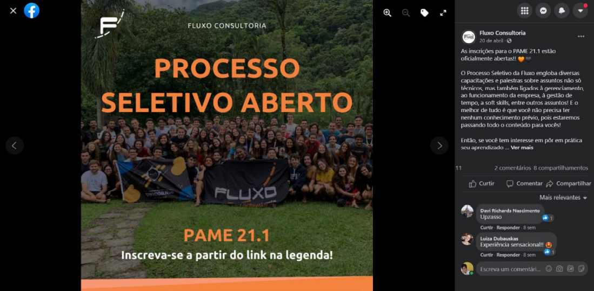

# Comandos do git

Fonte: [Básico](https://comandosgit.github.io/#basico)
\
\
Tornar um diretório em um repositório local git 

    git init

Ver o estatus do repositório, qual a *branch* atual e se os arquivos estão *tracked*, *staged*, etc.

    git status

Designar a origem repositório remoto do local

    git remote add origin {link}

##### **OBS:** No lugar de escrever o URL do repositório remoto, escreve-se `origin` no terminal.
\
Adicionar mudanças à *staging area*

    git add {diretório}

    # diretório inteiro
    git add . 

    # Lista de diretórios
    git add {diretório1}, {diretório2}

Confirmar as mudanças feitas

    git commit -m "{mensagem}"

##### **OBS:** O argumenro `-m` passa uma mensagem que será mostrada no GitHub.
\
Enviar as mudanças feitas de um repositório local para o remoto

    git push origin {branch}

    # Primeiro push deve ser
    git push origin HEAD

Coletar mudancas do repositorio remoto

    git fetch origin

Incorporar as mudancas ao repositorio local

    git pull origin {branch}

##### **OBS:** Equivalente à `git fetch origin` e `git merge {branch}`.
\
Remover um arquivo do Git

    git rm -f {arquivo}

Criar uma nova *branch*

    git branch {branch}

    # Muda para tal branch
    git checkout {branch}

    # Cria e muda para tal branch
    git checkout -b {branch}

Clonar um repositório remoto

    git clone {link} {diretorio destino}

##### **OBS:** O diretorio destino nao e obrigatorio.                                                                                         
\
[git rebase](https://livebook.manning.com/concept/git/git-rebase#:~:text=The%20git%20rebase%20command%20is,modifying%2C%20and%20even%20deleting%20commits.)
# Primeira Entrega

Recriar o HTML da seguinte página:

Para essa entrega pedimos que vocês façam um post do Facebook, seguindo as respectivas regras:

- O post deverá conter a mesma foto de publicação e o mesmo nome de usuário (Fluxo
Consultoria), mas pedimos que coloquem na legenda a opinião de vocês sobre o PAME até agora,
incluindo um ponto que poderíamos desenvolver para melhorar sua experiência
- O código deverá ser colocado no GitHub;

Os ícones do Facebook que vocês precisarão utilizar, serão enviados para vocês e o prazo da entrega
é para 17:00 do dia 29/06/2021.